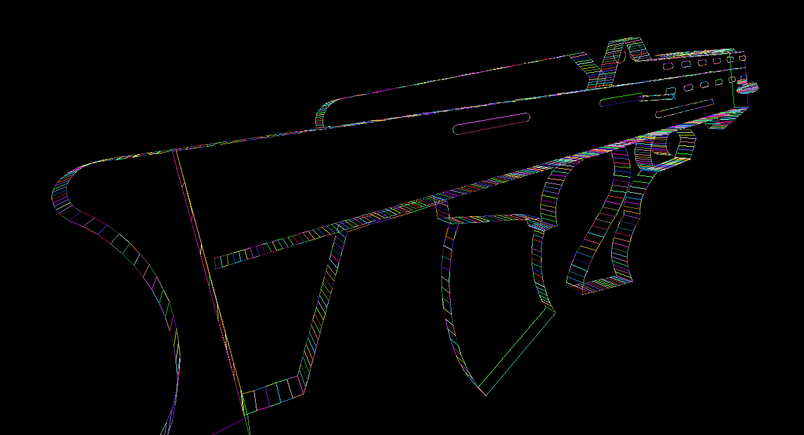

# Sci-fi-Firearm-3D-model
This is a 3D model of a scifi firearm using C#, it is done using simple camera control algorithms and simple transformation and parametric models algorithms only, no ready made functions were used in this project.
#### **This is the real image of the model**

#### **And this is the model created using the program**

## Controls
You can control the rotation on the three axes **(X,Y,Z)** by
**1- right clicking and moving the mouse cursor,
   2- using the (X,Y,Z) buttons on the Keyboard**

#### Changing The RGB colors using **Left and Right** arrows in the keyboard

